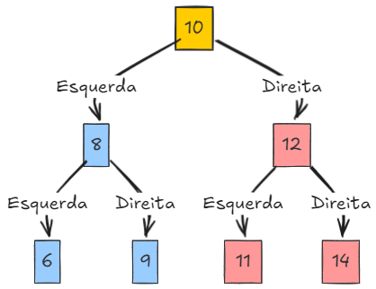

# 🌳 Implementação de Árvore Binária em C

<div align="center">
  <h2>Estrutura de Dados Hierárquica para Busca Eficiente</h2>
  <p>
    
    
    
    
  </p>
</div>

## 📋 Descrição do Projeto

Este projeto implementa uma estrutura de dados de Árvore Binária de Busca (ABB) em linguagem C, com diversas operações e funcionalidades para manipulação da árvore.

## 🔧 Estrutura

A árvore é definida pela seguinte estrutura:

```c
typedef struct arv{
    int Item;
    struct arv *Esq;
    struct arv *Dir;
} *Arv;
```

- `Item`: valor armazenado no nó
- `Esq`: ponteiro para a subárvore esquerda
- `Dir`: ponteiro para a subárvore direita

## 🚀 Funções Implementadas

### 🏗️ Criação e Destruição
- **`criarArv(Arv direita, int item, Arv esquerda)`**: Cria um novo nó de árvore com um item e subárvores especificadas.
- **`destroirArv(Arv *arv)`**: Libera toda a memória utilizada pela árvore e suas subárvores.

### 🔄 Percursos
- **`emOrdem(Arv arv)`**: Percorre a árvore em ordem (esquerda -> raiz -> direita).
- **`preOrdem(Arv arv)`**: Percorre a árvore em pré-ordem (raiz -> esquerda -> direita).
- **`posOrdem(Arv arv)`**: Percorre a árvore em pós-ordem (esquerda -> direita -> raiz).
- **`exibeDecrescente(Arv arv)`**: Exibe os elementos da árvore em ordem decrescente.

### 📊 Operações Básicas
- **`insert(Arv *arv, int item)`**: Insere um novo elemento na árvore mantendo as propriedades de uma ABB.
- **`remover(Arv *arv, int item)`**: Remove um elemento da árvore mantendo as propriedades de uma ABB.
- **`removerMaximo(Arv *arv)`**: Remove e retorna o valor máximo encontrado na árvore.
- **`busca(Arv arv, int item)`**: Busca um elemento na árvore e retorna 1 se encontrado, 0 caso contrário.
- **`tem(Arv arv, int item)`**: Função similar à busca, verifica se um elemento existe na árvore.

### 🔍 Análise de Propriedades
- **`nos(Arv arv)`**: Retorna o número total de nós na árvore.
- **`folhas(Arv arv)`**: Retorna o número de folhas (nós sem filhos) na árvore.
- **`altura(Arv arv)`**: Retorna a altura da árvore.
- **`ehArvBinaria(Arv arv)`**: Verifica se a árvore é uma árvore binária de busca válida.
- **`ehIgual(Arv arv1, Arv arv2)`**: Verifica se duas árvores são idênticas em estrutura e valores.

## 🔮 Aplicações Práticas

- Indexação de dados
- Buscas eficientes
- Ordenação de valores
- Implementação de conjuntos e mapas
- Algoritmos de compressão

## 🚀 Como Usar

1. Compile os arquivos `arvore.c` e `main.c` usando GCC:
   ```bash
   gcc main.c arvore.c -o arvore
   ```

2. Execute o programa gerado:
   ```bash
   ./arvore
   ```

## 📝 Exemplo

O arquivo `main.c` contém exemplos de uso de todas as funções implementadas, demonstrando como criar uma árvore binária de busca, inserir elementos, percorrê-la de diferentes maneiras e realizar outras operações.

## 📊 Arquitetura de uma Árvore Binária de Busca



## ⏱️ Complexidade

| Operação | Caso Médio | Pior Caso |
|----------|------------|-----------|
| Busca    | O(log n)   | O(n)      |
| Inserção | O(log n)   | O(n)      |
| Remoção  | O(log n)   | O(n)      |

Onde n é o número de nós na árvore.

## 📚 Recursos Adicionais

- [Visualização de Estruturas de Dados](https://visualgo.net/en/bst)
- [Wikipedia - Árvore Binária de Busca](https://pt.wikipedia.org/wiki/%C3%81rvore_bin%C3%A1ria_de_busca)
- [GeeksforGeeks - Binary Search Tree](https://www.geeksforgeeks.org/binary-search-tree-data-structure/)